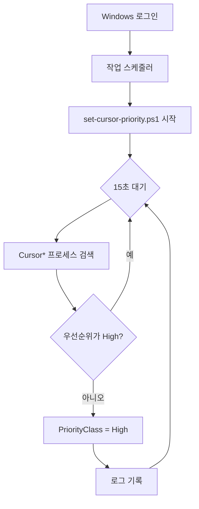

# cursor_faster

Windows에서 **Cursor IDE**의 CPU 우선순위를 **높음(High)** 으로 유지하는 도구입니다.

작업 관리자에서 수동으로 우선순위를 바꾸면 재부팅·재실행 시 **보통(Normal)** 으로 돌아갑니다.  
이 프로젝트는 **작업 스케줄러 + PowerShell** 로 로그인 후 백그라운드에서 Cursor 프로세스를 감시하고, 우선순위가 내려가면 자동으로 다시 **높음** 으로 맞춥니다.

> 어떤 방법으로 Cursor를 실행해도 적용됩니다. (작업 표시줄, 바로가기, `cursor` CLI, 자동 시작 등)

---

## 적용 대상

| 적용됨 | 설명 |
|--------|------|
| `Cursor.exe` | 메인 프로세스 |
| `Cursor Helper*.exe` | 렌더러, GPU, 플러그인 등 하위 프로세스 |
| **모든 Cursor 창** | 창을 여러 개 열어도 전부 적용 |

| 적용 안 됨 | 이유 |
|-----------|------|
| `msedgewebview2.exe` | Edge·다른 앱과 공유하는 WebView2 |
| `node.exe` 등 | Cursor 전용이 아닐 수 있음 |

---

## 빠른 설치 (권장)

PowerShell을 **관리자 권한 없이** 일반 사용자로 열고, 저장소를 클론한 뒤:

```powershell
cd C:\Users\<사용자>\.cursor\cursor_faster
.\scripts\install.ps1
```

설치가 끝나면 **한 번 로그아웃 후 다시 로그인**하거나, 아래처럼 감시 작업을 바로 시작할 수 있습니다.

```powershell
Start-ScheduledTask -TaskName 'CursorFaster-PriorityWatcher'
```

### 제거

```powershell
.\scripts\uninstall.ps1
```

---

## 수동 설치 (단계별)

### 1. 저장소 받기

```powershell
git clone https://github.com/gjtuc/cursor_faster.git C:\Users\<사용자>\.cursor\cursor_faster
cd C:\Users\<사용자>\.cursor\cursor_faster
```

### 2. 스크립트 위치 확인

기본 경로:

```
C:\Users\<사용자>\.cursor\cursor_faster\scripts\set-cursor-priority.ps1
```

`install.ps1` 은 이 경로를 자동으로 사용합니다. 다른 폴더에 두었다면 `install.ps1` 실행 시 `-ScriptPath` 로 지정하세요.

### 3. 작업 스케줄러 등록

```powershell
.\scripts\install.ps1
```

등록되는 작업 이름: **`CursorFaster-PriorityWatcher`**

| 항목 | 값 |
|------|-----|
| 트리거 | 사용자 로그온 시 |
| 동작 | PowerShell로 감시 스크립트 실행 (창 숨김) |
| 주기 | 15초마다 Cursor 프로세스 스캔 |
| 우선순위 | **High (높음)** |

### 4. 동작 확인

1. Cursor를 실행합니다.
2. 작업 관리자 → **자세히** 탭을 엽니다.
3. `Cursor.exe` 를 우클릭 → **우선 순위 설정** → **높음** 인지 확인합니다.

로그 파일 (선택):

```
%LOCALAPPDATA%\cursor_faster\watcher.log
```

---

## 파일 구성

```
cursor_faster/
├── README.md                      # 이 문서
├── LICENSE
└── scripts/
    ├── set-cursor-priority.ps1    # 백그라운드 감시 (작업 스케줄러가 실행)
    ├── install.ps1                # 작업 스케줄러 등록
    └── uninstall.ps1              # 작업 스케줄러·로그 제거
```

---

## 동작 원리



1. 로그인 시 PowerShell이 백그라운드에서 감시 스크립트를 실행합니다.
2. 15초마다 `Cursor` 로 시작하는 프로세스 이름을 찾습니다.
3. 우선순위가 **High** 가 아니면 **High** 로 변경합니다.
4. Cursor를 나중에 켜도, 다음 스캔 주기 안에 자동 적용됩니다.

---

## 설정 변경

`scripts\set-cursor-priority.ps1` 상단의 설정 블록을 수정한 뒤, 감시 작업을 재시작하세요.

```powershell
Stop-ScheduledTask -TaskName 'CursorFaster-PriorityWatcher' -ErrorAction SilentlyContinue
Start-ScheduledTask -TaskName 'CursorFaster-PriorityWatcher'
```

| 변수 | 기본값 | 설명 |
|------|--------|------|
| `$TargetPriority` | `High` | `Normal`, `AboveNormal`, `High` 등 |
| `$ScanIntervalSeconds` | `15` | 스캔 주기(초). 너무 짧으면 CPU 소모 증가 |
| `$EnableLogging` | `$true` | 로그 파일 기록 여부 |

> **실시간(Realtime)** 은 시스템 불안정을 일으킬 수 있어 지원하지 않습니다.

---

## 주의 사항

### CPU vs 메모리

우선순위는 **CPU 시간 배분**만 바꿉니다. 작업 관리자에 보이는 **메모리 사용량(RAM)** 은 줄지 않습니다.

### 여러 Cursor 창

창마다 프로세스가 여러 개 뜨므로, 전부 **높음** 으로 올라갑니다. 동시에 Cursor를 많이 쓰면 다른 프로그램이 느려질 수 있습니다.

### 백신 / 회사 PC

V3, Windows Defender 등이 스크립트 실행을 차단할 수 있습니다. 차단 시 예외 등록이 필요할 수 있습니다.

### 재부팅 후

작업 스케줄러에 등록되어 있으면 **로그인할 때마다 자동 시작**됩니다. 작업 관리자에서 수동으로 바꾼 것과 달리 **영구적으로 유지**됩니다.

---

## 문제 해결

### 우선순위가 안 바뀜

```powershell
# 작업 상태 확인
Get-ScheduledTask -TaskName 'CursorFaster-PriorityWatcher' | Get-ScheduledTaskInfo

# 수동 실행
Start-ScheduledTask -TaskName 'CursorFaster-PriorityWatcher'

# 로그 확인
Get-Content "$env:LOCALAPPDATA\cursor_faster\watcher.log" -Tail 20
```

### 실행 정책 오류

`install.ps1` 이 `-ExecutionPolicy Bypass` 를 작업 스케줄러 인수에 포함합니다. 그래도 오류가 나면:

```powershell
Set-ExecutionPolicy -Scope CurrentUser RemoteSigned
```

### 작업이 안 보임

```powershell
Get-ScheduledTask | Where-Object TaskName -like 'CursorFaster*'
```

---

## 라이선스

MIT License — 자유롭게 사용·수정·배포할 수 있습니다.

---

## 기여

이슈·PR 환영합니다.  
우선순위 이름, 스캔 주기, 로그 형식 등 개선 제안도 좋습니다.
